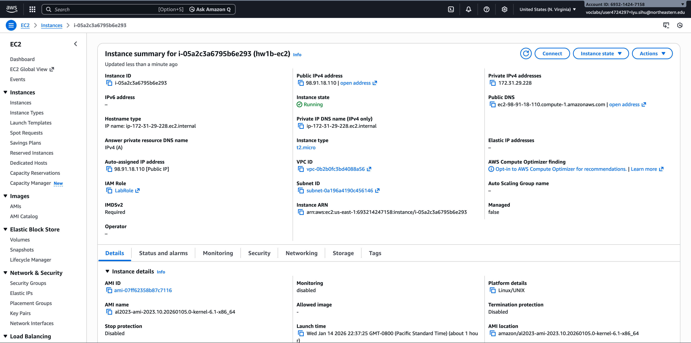
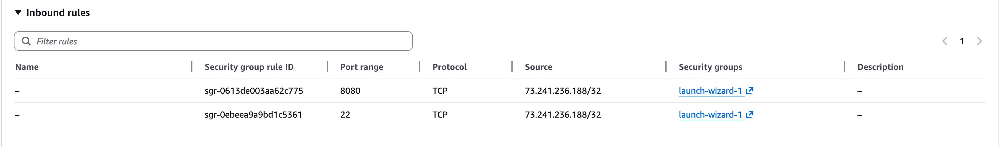
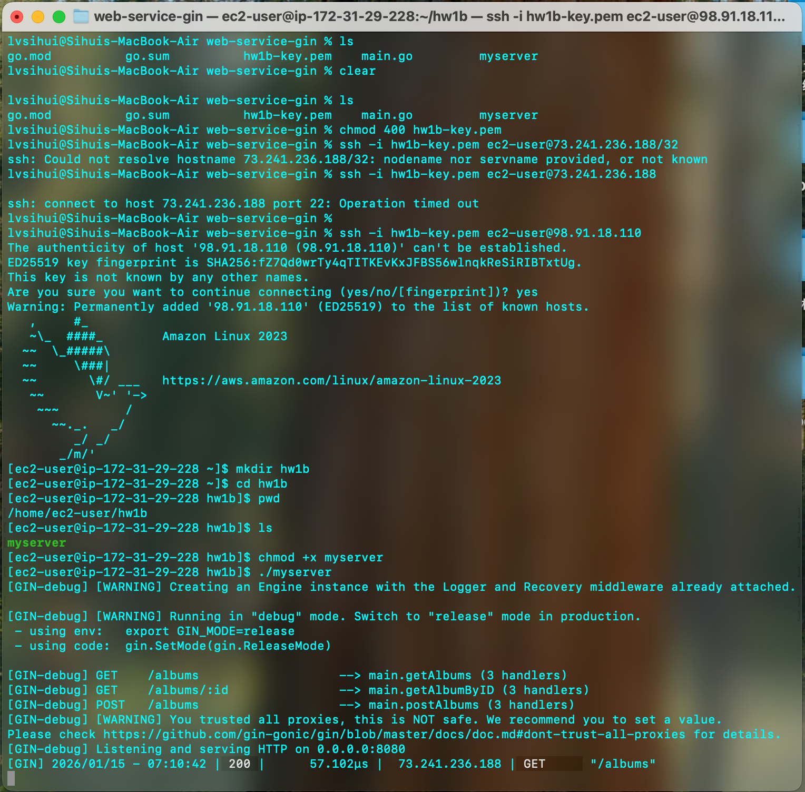
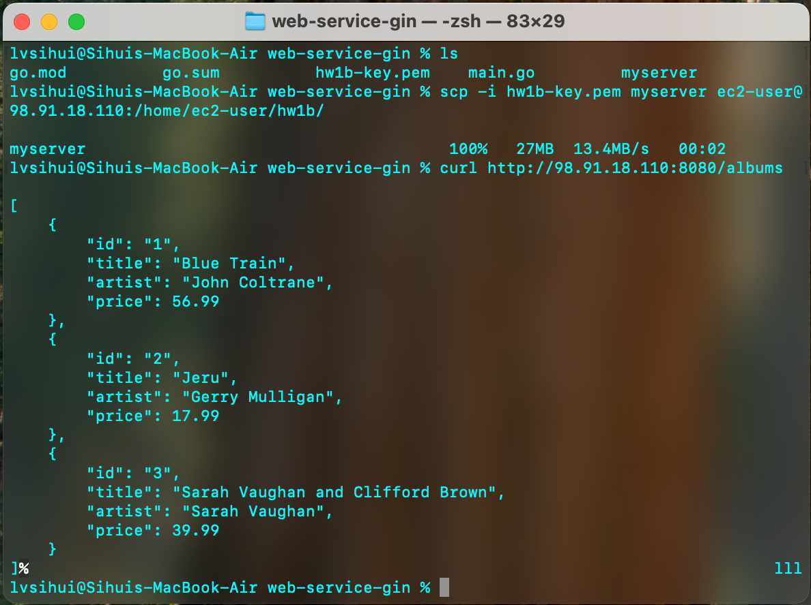
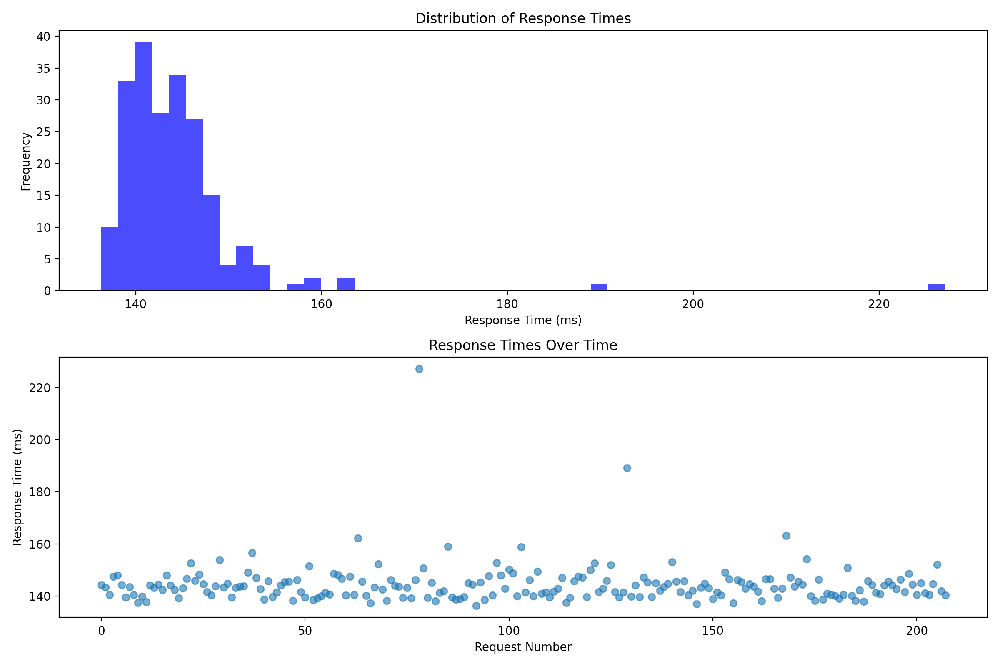

# Homework 1b – Rocking AWS!

Go Gin Backend Deployment on AWS EC2

---

## Part I – Deployment Summary

I deployed a Go Gin backend service to an AWS EC2 instance. The main steps were:

1. Created an EC2 instance (Amazon Linux 2023, `t2.micro`) and configured the security group.
2. Enabled:
   - SSH access on port **22**
   - HTTP access on port **8080**
3. Cross-compiled the Go application for Linux.
4. Uploaded the compiled binary to EC2 using `scp`.
5. Ran the service on EC2 and confirmed it was listening on `0.0.0.0:8080`.
6. Tested the service using `curl` and a web browser.

Screenshots:

- EC2 instance overview  
  

- Security group inbound rules  
  

- Uploading binary and running server  
  

- Testing endpoint with curl  
  

This part demonstrates:

- Remote server deployment
- Secure access via SSH
- Cloud networking configuration
- Running a backend service in production-like conditions

---

## Part II – Learning Outcomes

A **Virtual Machine (VM)** is a cloud-hosted computer that runs independently from my local machine.  
Running programs on a VM differs from local execution because it introduces:

- Network latency
- Security constraints (firewalls, IP restrictions)
- Resource limits (CPU, memory, bandwidth)

If my IP address changes, I must update the **Security Group inbound rules** to allow SSH access again.

EC2 instances receive a new public IP when they are restarted.  
Using an **Elastic IP** provides a stable public IP but comes with extra cost.

The **instance type** defines the level of service I am paying for:

- CPU capacity
- Memory size
- Network performance

These directly impact performance, scalability, and reliability.

Compared to GCP, AWS required:

- More manual network configuration
- Explicit security group management
- Greater control and visibility over infrastructure

Testing methods used:

- `curl` to test API endpoints
- Browser testing
- Python-based load testing

---

## Part III – Performance Testing Results

I created a Python script that:

- Sent sequential GET requests for 30 seconds
- Recorded response times
- Generated a histogram and scatter plot
- Computed latency statistics

Performance visualization:

### Observations

The histogram shows a **long-tail latency distribution**:

- Most requests clustered around **~140 ms**
- A small number of slow outliers reached **200+ ms**

Key findings:

- Response times were mostly stable with occasional spikes.
- The median response time was significantly lower than the 95th percentile, showing latency variability.
- Running on a single small EC2 instance limits performance.
- With **100 concurrent users**, delays would increase and the long tail would become more severe.
- Both **network latency** and **server-side processing** contribute to slow responses.

This demonstrates why understanding tail latency is important for real-world system reliability and user experience.
