# Homework 2: MapReduce, Terraform, Docker... and Claude Code!

This document summarizes my work for Homework 2, including Terraform-based EC2 automation, Docker containerization and deployment, a stateful multi-instance consistency demo, and a short investigation of a mystery bug using Claude Code.

---

# Part II – Get Started with Terraform

## Overview

In this part, I used Terraform (Infrastructure as Code) to automatically create and destroy an EC2 instance on AWS. This approach is reproducible and avoids manual “clicking” in the AWS Console.

---

## Step 1 – Create EC2 Instance and SSH Login

This screenshot shows that the EC2 instance was created successfully and that I was able to connect to it using SSH:

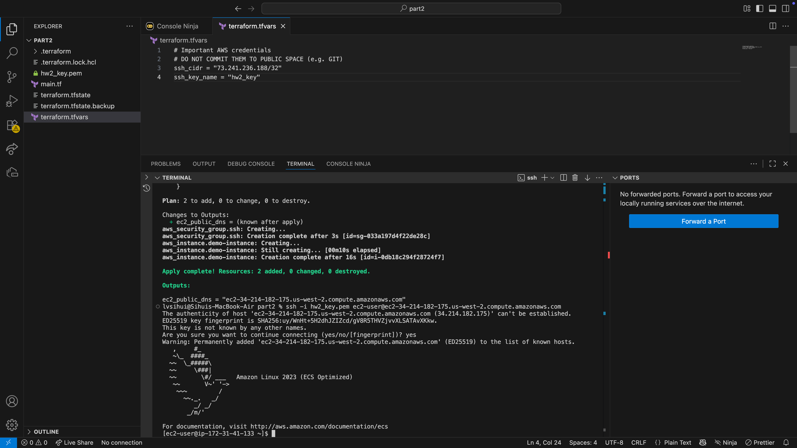

---

## Step 2 – Destroy EC2 Instance

After completing the task, I destroyed all the AWS resources created by Terraform.

This screenshot shows that the destroy process finished successfully:

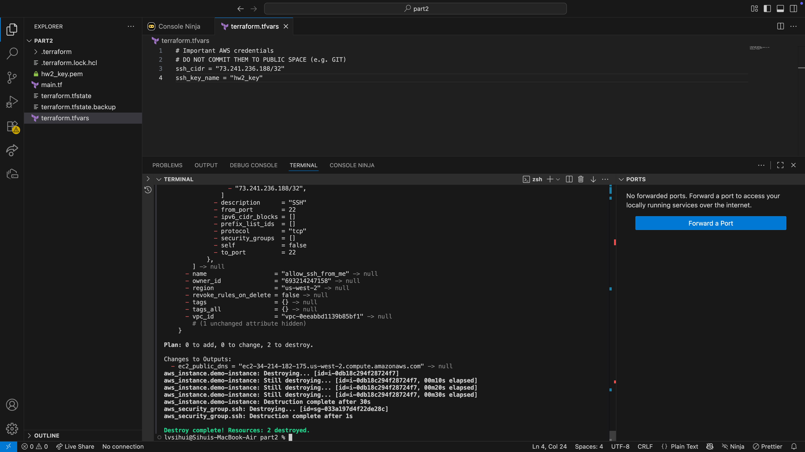

---

## Summary / What I Learned

Terraform allows me to:

- Create EC2 instances using code instead of manual setup (Infrastructure as Code)
- Reproduce the same infrastructure workflow reliably (easy to recreate or repeat)
- Connect to instances through SSH using an existing AWS key pair
- Clean up resources safely with a single command (`terraform destroy`)

---

# Part III – Getting Started with Lightweight Containers and Docker

## Overview

In this part, I containerized my Go album service using Docker and successfully ran it both locally and on an AWS EC2 instance. Docker packages the application together with its dependencies so the service can run consistently across machines.

---

## Step 1 – Build Docker Image Locally

I first built the Docker image on my local machine.

The screenshot below shows that the Docker image was built successfully:

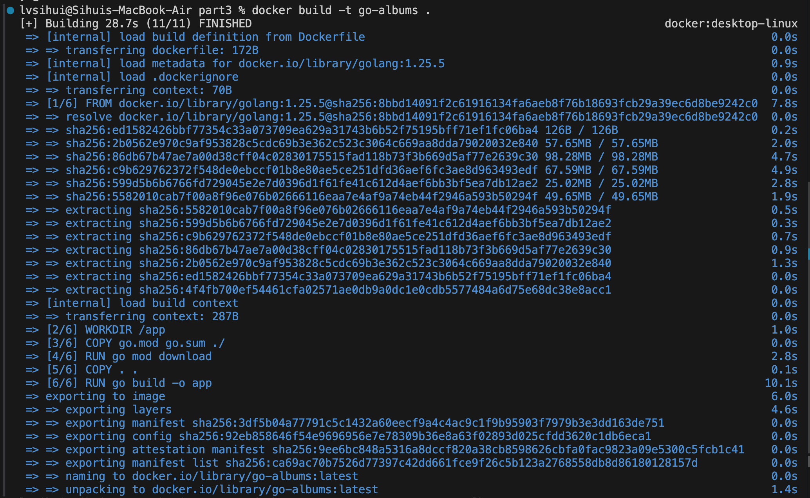

---

## Step 2 – Run the Container Locally

I ran the container and exposed port 8080.  
As shown in the screenshot below, the server started successfully inside Docker, which means the application is now running in a container.

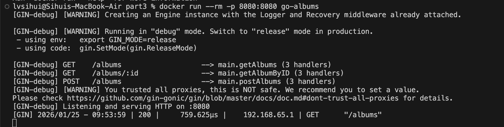

---

## Step 3 – Test Locally with curl

I tested the service using `curl`.  
As shown below, the album data was returned successfully, proving that the containerized application works correctly.

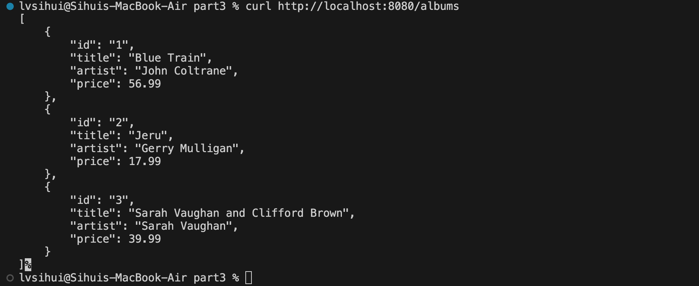

---

## Step 4 – First Attempt: Build Directly on AWS (Failed)

At first, I tried building the Docker image directly on my EC2 instance.  
However, since the instance type was **t2.micro**, it has very limited memory and CPU resources.

As a result, the Docker build process was extremely slow and sometimes failed due to insufficient memory.  
Because of this, I decided to change my approach.

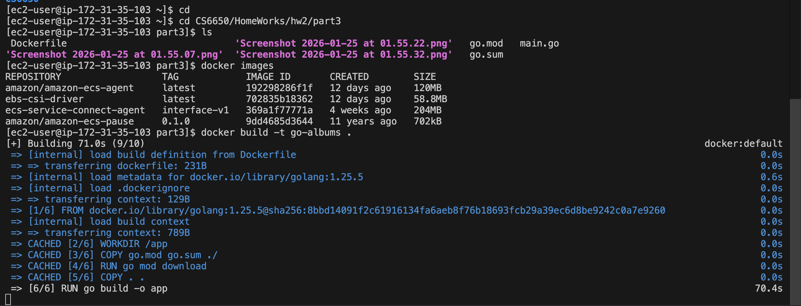

---

## Step 5 – New Strategy: Build Locally and Ship the Image to AWS

Instead of building on EC2, I built the Docker image locally (faster and more stable), then transferred the built image to the EC2 instance and loaded it into Docker there.

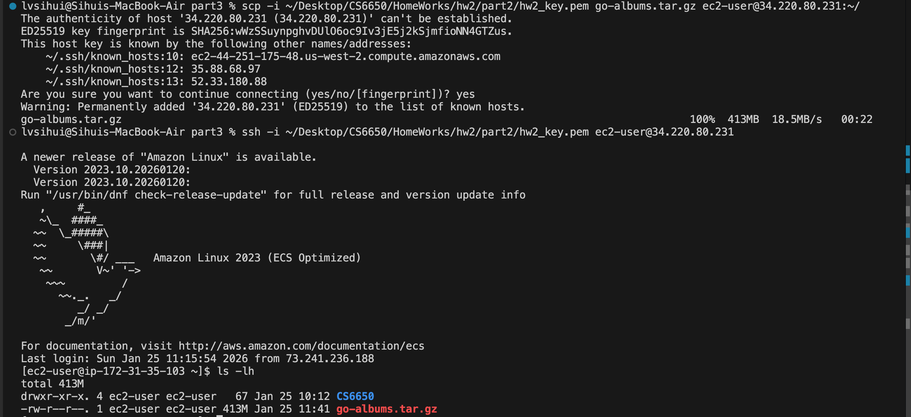

---

## Step 6 – Load Image, Run, and Test on EC2

After loading the image on EC2, I ran the container and tested the service.  
The album data was returned successfully, proving that the Docker container works correctly on AWS.

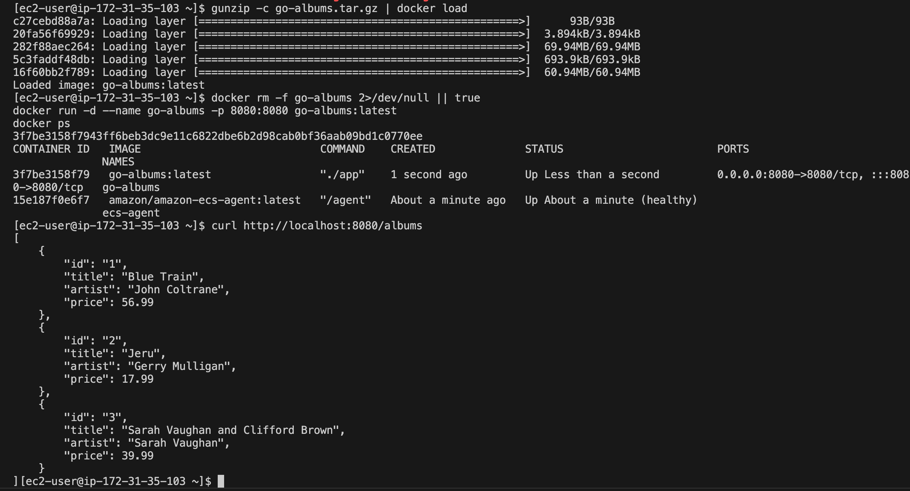

---

## What Did I Learn?

- Docker allows me to package my application together with all of its dependencies.
- I do **not** need to install Go on the EC2 instance because everything needed to run the app is inside the Docker image.
- Building locally and shipping the image to the cloud is much faster and more reliable than building directly on a small EC2 instance.
- Containers make deployments consistent and reproducible across different machines (similar to real CI/CD pipelines where images are built once and deployed many times).

---

# Part IV – Check this out!

## Overview

This part demonstrates what happens when the same _stateful_ service is deployed on multiple EC2 instances without shared storage.

---

## Step 1 – Two EC2 Instances Are Running

This screenshot shows that I successfully created and ran two EC2 instances.

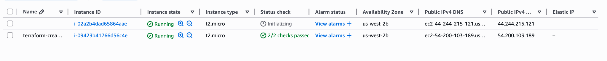
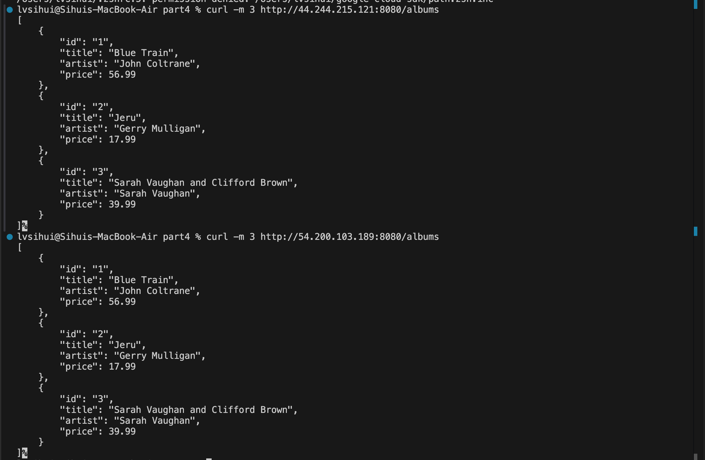

---

## Step 2 – Initial State (Both Instances Are Identical)

At the beginning, both instances return the same three albums.

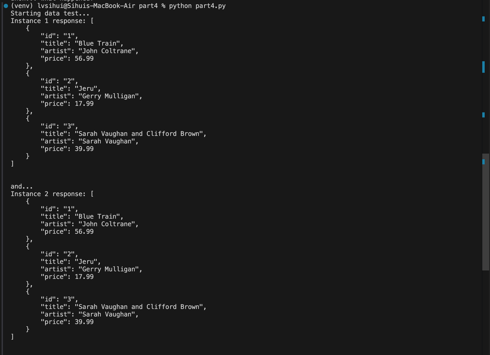

---

## Step 3 – POST to Only One Instance

I sent a POST request to Instance 2 to add a new album.

Instance 2 updated successfully, but Instance 1 stayed unchanged.

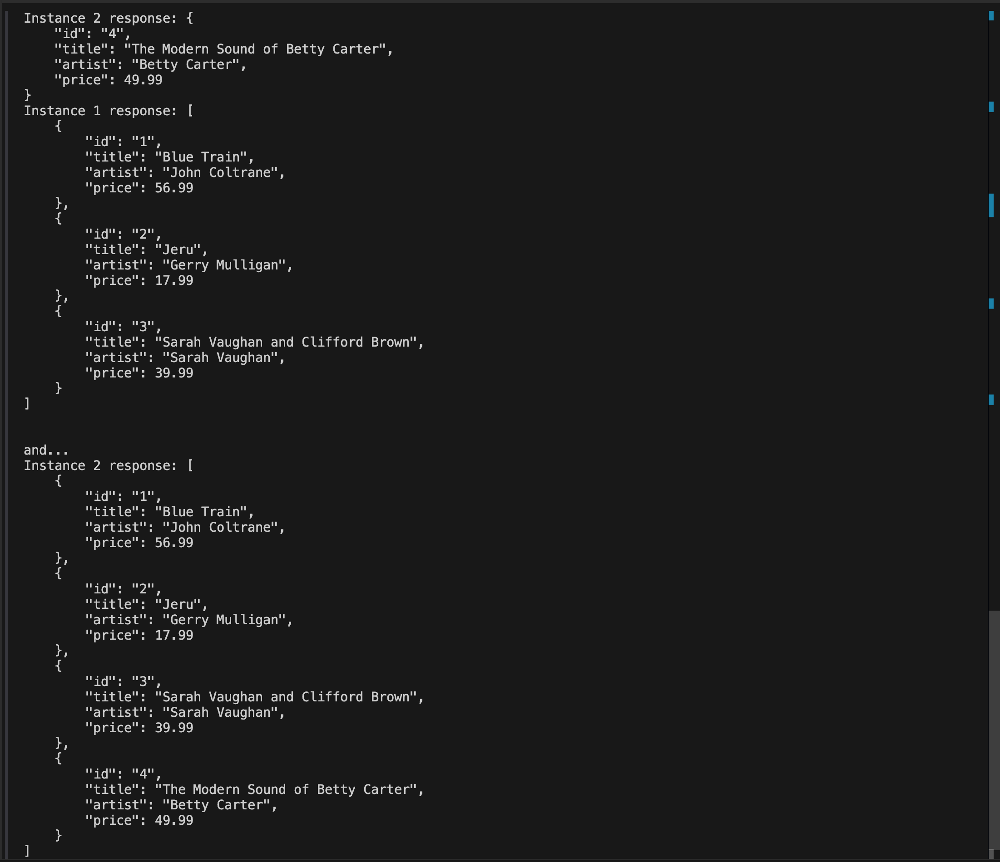

---

## What Is Happening (Why “uhoh…”)?

Each EC2 instance runs its own Docker container and stores album data **in memory** locally.  
There is **no shared database** between the two instances.

When I added data to Instance 2:

- Only Instance 2 updated its in-memory state.
- Instance 1 did not know about the change.
- The overall system became inconsistent across instances.

This demonstrates that running multiple **stateful** instances without shared storage leads to data inconsistency.

In real systems, services are typically designed to be **stateless** and use a **shared database** so that any instance can serve consistent data.

---

## Summary

| Step       | Result                           |
| ---------- | -------------------------------- |
| Initial    | Both instances had the same data |
| After POST | Only Instance 2 changed          |
| Final      | Data became inconsistent         |

This explains the “uhoh… what happened?” moment.

---

# Part V – An Exploration of a System using Claude Code!

## Time Spent

I spent about **35–40 minutes** interacting with Claude Code (excluding the time spent watching the setup video).

---

## Mystery Bug Description

With Claude Code’s help, I found that the bug is a **race condition** in the `postAlbumCount` function in `main.go`.

This endpoint tries to increase an album’s count by 10,000 by launching 10,000 goroutines at the same time. Each goroutine does:

```go
current := albumCounts[index].Count
albumCounts[index].Count = current + 1
```

Because there is no synchronization (no mutex or atomic operation), multiple goroutines read and write the shared counter simultaneously. This causes many updates to be overwritten, so the final count is much smaller than expected and changes unpredictably each run.

---

## Evidence Used

- The **unsynchronized read–modify–write pattern** is clearly visible in the code
- The final album count **changes randomly** between executions
- This behavior is a direct symptom of a race condition in concurrent programming

---

### Location of the Bug

- **File:** `main.go`
- **Function:** `postAlbumCount`

No external logs were strictly required, because the bug can be proven directly from the implementation.  
The lack of any locking or atomic operation around shared memory access is sufficient to demonstrate why updates are lost.

---
