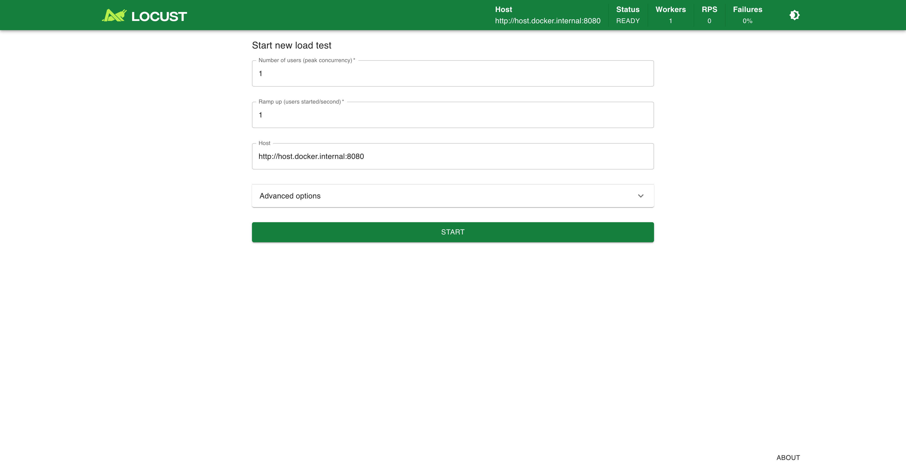
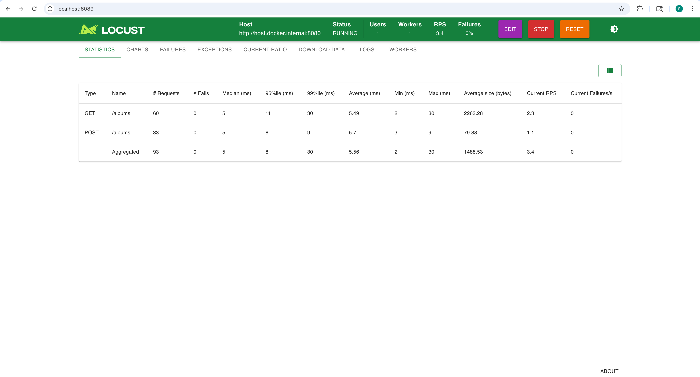
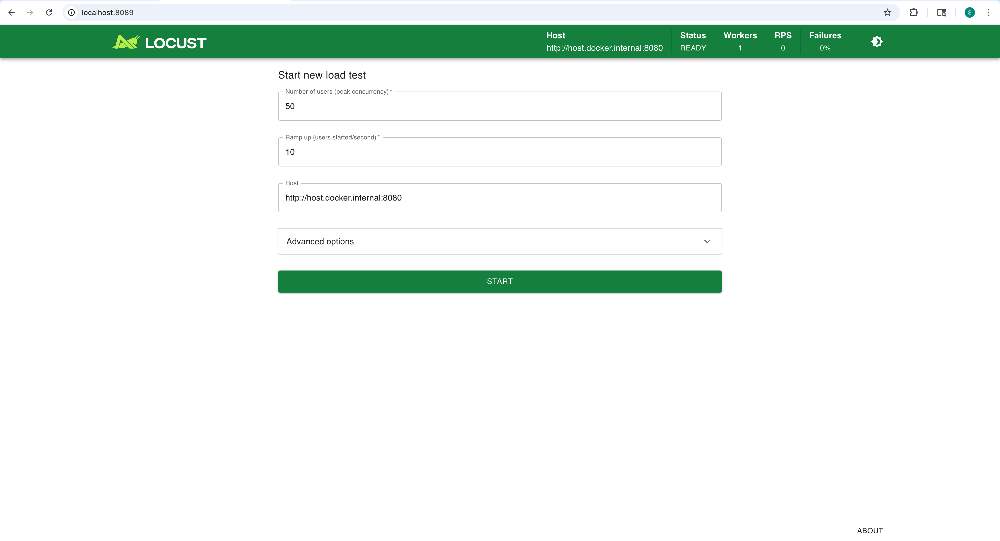
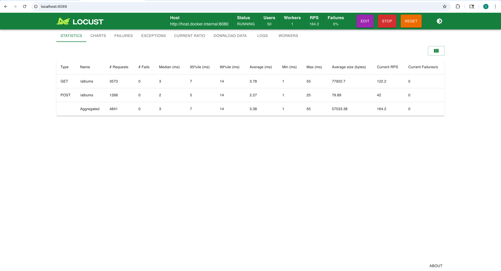
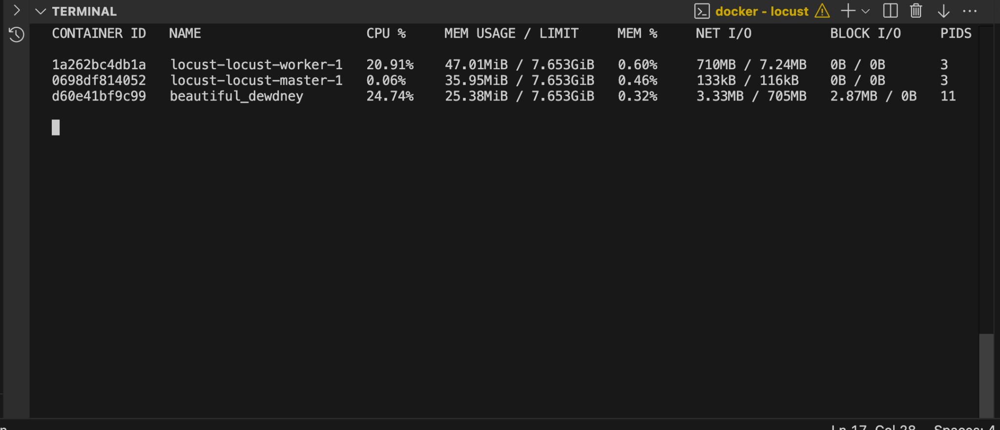
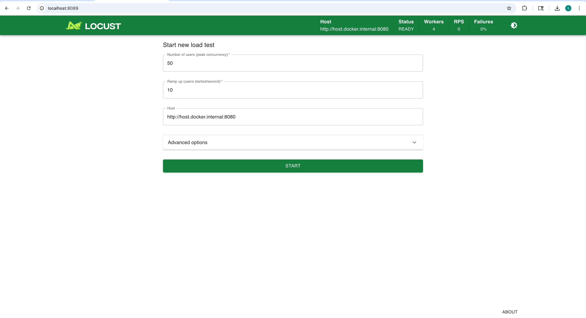
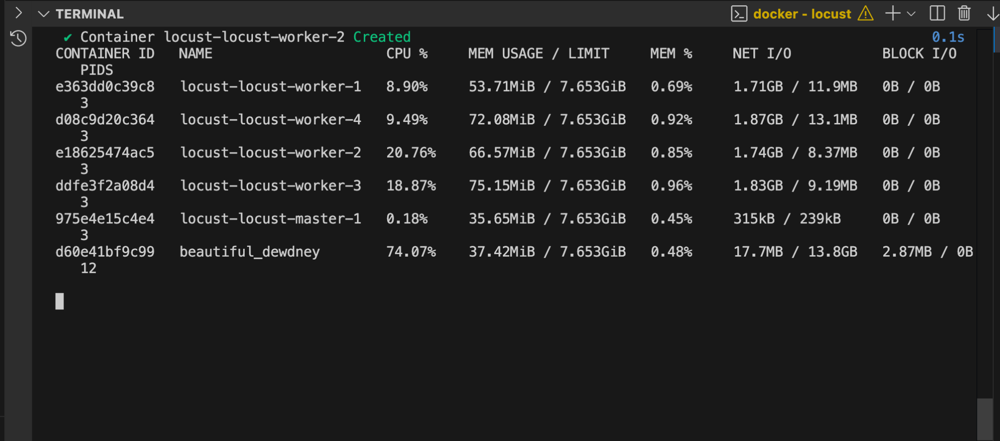
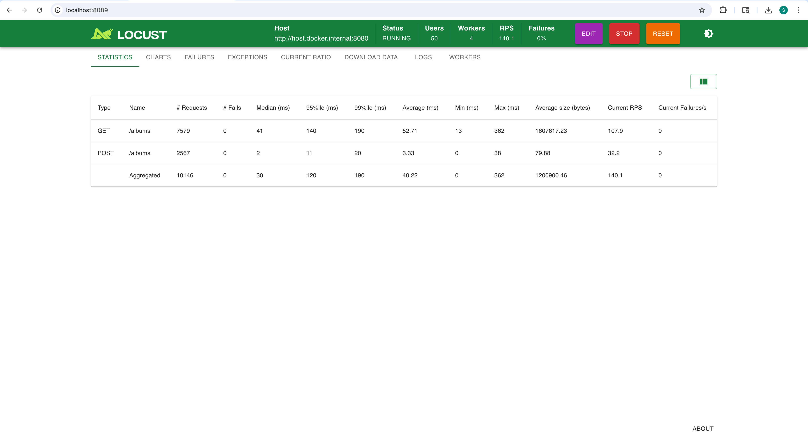
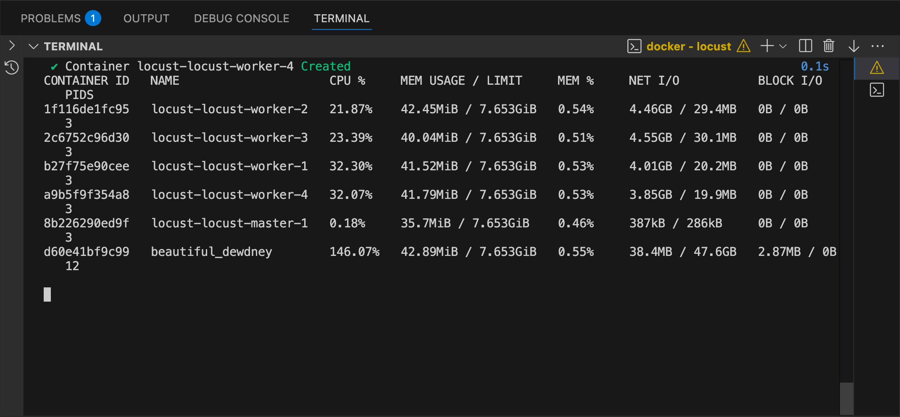

# Homework 2: MapReduce, Terraform, Docker... and Claude Code!

This document summarizes my work for Homework 2, including Terraform-based EC2 automation, Docker containerization and deployment, a stateful multi-instance consistency demo, and a short investigation of a mystery bug using Claude Code.

---

# Part I

## What I liked:

I liked how this paper rethinks the concept of time in distributed systems. It shows that there is no natural “global time,” and that what really matters is the causal relationship between events: who can influence whom. The idea of logical clocks is very elegant, because it shows that we can artificially define a notion of time that preserves causality and is still powerful enough to solve synchronization problems. I also liked that the paper points out the limitations of this artificial ordering and explains how synchronized physical clocks can be used if we want system behavior to match real-world time. Overall, it changed how I understand “time” in distributed systems and felt very novel and insightful.

## What I didn’t like:

The paper is very theoretical and abstract, which made it hard to understand at times. Many ideas are presented in a formal way, and it was difficult to build intuition without more concrete examples. I also felt the writing was dense and not very beginner-friendly, so even when I understood the big idea, the technical details were sometimes overwhelming.

---

# Part II – Thread Experiments Report

This report summarizes a series of experiments exploring atomicity, concurrent data structures, file persistence, and context switching in Go.

---

## 1. Atomicity

I compared an atomic counter (`atomic.Uint64` with `Add(1)`) with a normal integer counter (`ops++`) updated concurrently by 50 goroutines, each performing 1,000 increments.

### Results

- Atomic version: always returned **50000**.
- Non-atomic version: returned values much smaller than 50000 and varied across runs.
- Running with `-race` reported multiple **DATA RACE** warnings.

### Explanation

`ops++` is not atomic. It is a read → modify → write sequence, which can be interrupted by other goroutines, causing lost updates.  
Atomic operations make updates indivisible and guarantee correctness.

**Lesson:**  
Atomic operations are essential for safe concurrent updates. The `-race` flag is a powerful tool for detecting unsafe shared-memory access.

---

## 2. Collections: Concurrent Writes to Maps

Each experiment used:

- 50 goroutines
- 1,000 writes per goroutine  
  Expected final size: **50,000**

---

### 2.1 Plain map

Using a regular `map[int]int`:

Running the plain map version three times resulted in a crash every time with the error  
`fatal error: concurrent map writes`, showing that Go’s built-in map is not safe for concurrent writes and will consistently fail under this workload.

**Explanation:**  
Go’s map is not thread-safe. Concurrent writes corrupt its internal structure, so the runtime panics to prevent silent memory corruption.

---

### 2.2 Mutex

Using a `sync.Mutex` to protect every write:

| Run      | Time (ms)   |
| -------- | ----------- |
| 1        | 9.51        |
| 2        | 12.78       |
| 3        | 6.05        |
| **Mean** | **9.45 ms** |

- `len(m)` was always `50000`.

**Lesson:**  
Mutex restores correctness but serializes all access. It trades performance for safety and becomes a bottleneck under heavy contention.

---

### 2.3 RWMutex

Replacing `Mutex` with `RWMutex`:

| Run      | Time (ms)   |
| -------- | ----------- |
| 1        | 6.61        |
| 2        | 12.22       |
| 3        | 6.18        |
| **Mean** | **8.34 ms** |

- `len(m)` was always `50000`.

**Lesson:**  
RWMutex offers little benefit in write-heavy workloads. Its advantage only appears when reads dominate.

---

### 2.4 sync.Map

Using Go’s concurrent map implementation:

| Run      | Time (ms)   |
| -------- | ----------- |
| 1        | 5.51        |
| 2        | 6.78        |
| 3        | 4.38        |
| **Mean** | **5.55 ms** |

- `len(m)` was always `50000`.

**Lesson:**  
`sync.Map` was the fastest in this experiment. It is optimized for concurrent access and reduces lock contention, but it has a more complex API and is best suited for read-heavy or read-mostly workloads.

---

### 2.5 Comparison Summary

| Approach  | Mean Time (ms) | Correctness | Notes                                   |
| --------- | -------------- | ----------- | --------------------------------------- |
| Plain map | N/A            | ❌          | Not thread-safe                         |
| Mutex     | 9.45           | ✅          | Simple, but serializes all access       |
| RWMutex   | 8.34           | ✅          | Best for read-heavy workloads           |
| sync.Map  | 5.55           | ✅          | Best performance here, more complex API |

**If reads dominate:**  
`RWMutex` and `sync.Map` usually outperform `Mutex` because they allow concurrent readers.

---

## 3. File Access: Buffered vs Unbuffered I/O

We wrote 100,000 lines to a file in two ways.

| Mode       | Run1      | Run2      | Run3      | Mean          |
| ---------- | --------- | --------- | --------- | ------------- |
| Unbuffered | 126.46 ms | 130.32 ms | 107.63 ms | **121.47 ms** |
| Buffered   | 0.76 ms   | 0.61 ms   | 0.60 ms   | **0.65 ms**   |

Buffered I/O was about **200× faster**.

**Explanation:**  
Unbuffered mode performs a system call for each write.  
Buffered mode accumulates data in memory and flushes it in large chunks, drastically reducing system call overhead.

**Tradeoff:**  
Buffering improves performance but weakens durability guarantees: data may be lost if the program crashes before `Flush()`.

---

## 4. Context Switching

Two goroutines passed a signal back and forth over an unbuffered channel 1,000,000 times.

| Mode                | Mean Switch Time |
| ------------------- | ---------------- |
| GOMAXPROCS = 1      | **82 ns**        |
| GOMAXPROCS = NumCPU | **114 ns**       |

Single-thread execution was faster.

**Explanation:**  
With one OS thread, all scheduling occurs in user space.  
With multiple OS threads, communication involves cross-thread synchronization, cache coherence, and memory barriers, which increase overhead.

**Relation to distributed systems:**

Goroutine context switching is extremely lightweight compared to switching between processes, containers, and virtual machines. Goroutines share memory and are scheduled in user space, while processes and VMs require kernel involvement and hardware-level state changes.

---

# Part III – Making Threads Work Hard with Load Testing (Locust)

## Overview

In this part of the assignment, I used **Locust**, a Python-based load testing tool, to evaluate the performance of my server under concurrent load. The experiments focus on understanding how throughput and latency change under different levels of concurrency, how GET and POST requests behave differently, and how system bottlenecks relate to **Amdahl’s Law** and client-side overhead.

All experiments were conducted using Dockerized Locust **master/worker** mode and monitored with `docker stats`.

---

## Test Setup

- **Server endpoint**: `http://host.docker.internal:8080`
- **GET endpoint**: `/albums`
- **POST endpoint**: `/albums`
- **Task ratio**: GET : POST = **3 : 1**
- **Wait time**: `between(0.1, 0.5)`
- **Load generator**: Locust (Docker)

The Locust task definition simulates:

- **GET requests** as read-heavy operations
- **POST requests** as write operations to shared in-memory data structures

---

## Warm-up Test (Correctness Check)

### Configuration

- Users: **1**
- Workers: **1**
- Ramp-up: **1 user/sec**

### Observations

- Both **GET /albums** and **POST /albums** requests succeeded
- **Failures = 0**
- Response times were low and stable

This warm-up run confirmed that the Locust configuration, endpoints, and Docker networking were correct before applying higher load.

---

## Local Load Test (1 Worker)

### Configuration

- Users: **50**
- Workers: **1**
- Ramp-up: **10 users/sec**
- Task ratio: **3 GET : 1 POST**

### Results

- Aggregate throughput: **~164 requests/sec**
- GET throughput: **~122 RPS**
- POST throughput: **~42 RPS**
- **Failures = 0**

### Latency

- GET p95 latency: ~7 ms
- POST p95 latency: ~5 ms
- p99 latency: ~14 ms

### Resource Usage

Using `docker stats`:

- Moderate CPU utilization on the server
- Low memory usage across all containers

### Analysis

The throughput closely matched the configured task ratio (3:1), indicating that Locust scheduling worked as expected. Both GET and POST requests exhibited low latency, showing that the server was not yet resource-bound at this load level.

---

## Amdahl’s Law Experiment (4 Workers)

### Configuration

- Users: **50**
- Workers: **4**
- Ramp-up: **10 users/sec**
- Task ratio unchanged

### Results

- Aggregate throughput: **~160 requests/sec**
- Throughput did **not** scale linearly compared to the 1-worker case
- GET p95 latency increased to ~26 ms
- GET p99 latency increased to ~47 ms
- **Failures = 0**

### Resource Usage

- Server CPU utilization increased to approximately **70–75%**
- Locust workers remained active, but overall throughput did not improve

### Analysis (Amdahl’s Law)

Increasing the number of workers did not lead to higher throughput. According to **Amdahl’s Law**, the performance improvement from parallelism is limited by the non-parallelizable portions of the system.

In this case:

- All requests were handled by a **single server instance**
- GET and POST operations accessed **shared in-memory data structures (hashmaps)**
- Increased concurrency resulted in lock contention and CPU saturation

As a result, adding more workers increased contention and latency without improving throughput.

---

## Context Switching Experiment (FastHttpUser)

### Change Introduced

The Locust client was switched from `HttpUser` to `FastHttpUser`, which uses a faster, C-based HTTP client designed for high concurrency.

### Configuration

- Users: **50**
- Workers: **4**
- Ramp-up: **10 users/sec**

### Results

- Aggregate throughput: **~140 requests/sec**
- Median latency increased to ~30 ms
- p95 latency increased to ~120 ms
- p99 latency increased to ~190 ms

### Resource Usage

- Locust worker CPU usage increased significantly (~20–32%)
- Server CPU exceeded **100%**, indicating full CPU saturation

### Analysis

Switching to `FastHttpUser` reduced client-side overhead and allowed Locust to generate requests more aggressively. However, the server became fully CPU-bound. Once the server was saturated, additional client efficiency did not improve throughput and instead increased contention, context switching, and tail latency.

This demonstrates that optimizing the load generator alone cannot improve system performance once the server becomes the primary bottleneck.

---

## Tradeoffs and Real-World Implications

In real-world systems, **read operations are typically more common than write operations**, making GET-heavy workloads the norm. This affects data structure and synchronization choices:

- Read-heavy workloads benefit from read-optimized structures (e.g., caching, read-write locks)
- Write operations introduce contention and can block reads
- Shared mutable state limits scalability under high concurrency

These experiments illustrate how architectural decisions directly impact system scalability and latency.

---

## Conclusion

These experiments show that:

- Throughput does not scale linearly with concurrency due to **Amdahl’s Law**
- Shared resources and CPU saturation are major scalability limits
- Client-side optimizations such as `FastHttpUser` can shift bottlenecks but cannot remove them

Effective system design requires identifying and addressing true bottlenecks rather than simply increasing parallelism. Locust proved to be a valuable tool for exploring these tradeoffs in practice.
