# Homework 4: Awesome Tools for Workflows!

---

# Part II: Infrastructure set up!

## Step 1 & 2 : Configure & Setup ECR

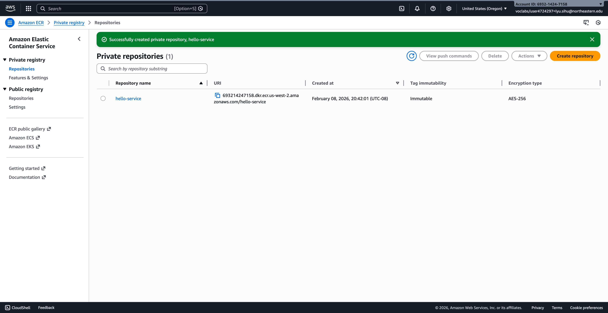

## Step 3: Push Docker Image to ECR

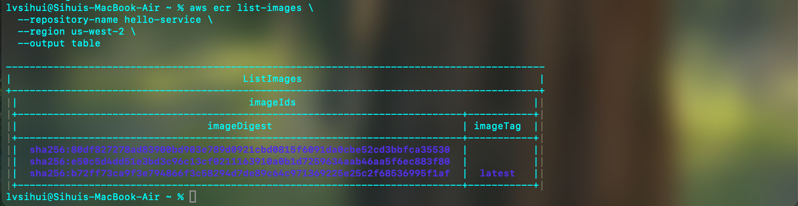

## Step 4: Create ECS Cluster

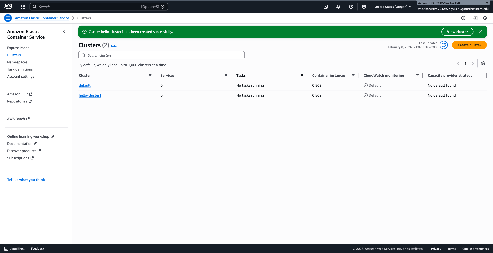

## Step 5: Create Task Definition

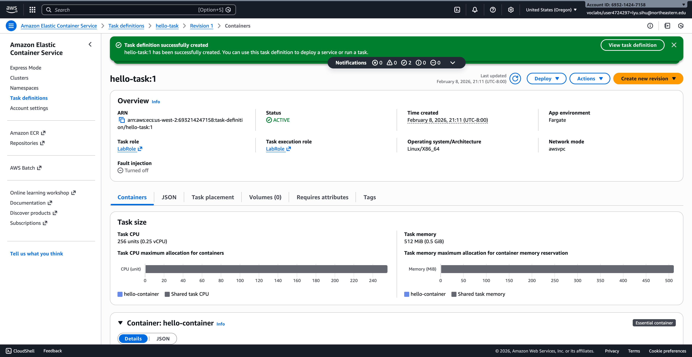

## Step 6: Run a Task

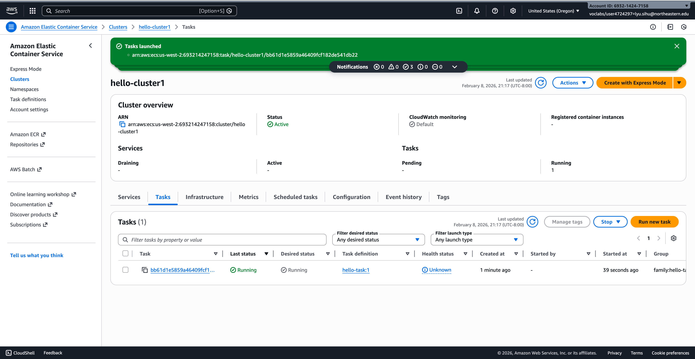

## Step 7: Getting the Public IP and Testing!

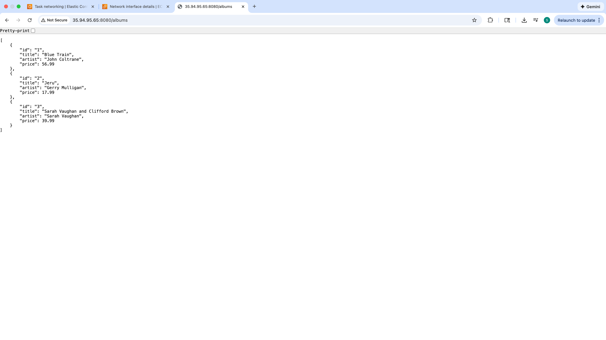
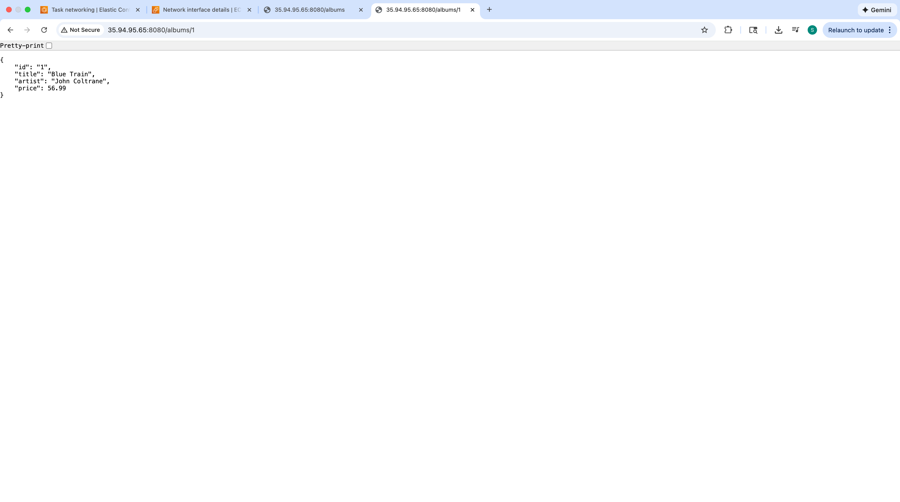

# Reflection: ECR/ECS Workflow and Core Networking Concepts

## Difference Between EC2 and ECS

Amazon EC2 (Elastic Compute Cloud) provides virtual machines that give users full control over the operating system, networking, and installed software. It is best suited for applications that require deep customization or legacy systems that cannot easily be containerized.

Amazon ECS (Elastic Container Service), on the other hand, is a container orchestration service designed to run Docker containers. Instead of managing servers, developers focus on deploying applications inside containers. When using ECS with Fargate, AWS handles infrastructure management such as provisioning, scaling, and patching.

**Key Differences:**

| EC2                      | ECS                            |
| ------------------------ | ------------------------------ |
| Manages virtual machines | Manages containers             |
| Requires OS maintenance  | Serverless option with Fargate |
| More control             | Less operational overhead      |
| Higher management effort | Faster deployment              |

**Conclusion:**  
EC2 is ideal when full control is necessary, while ECS is better for scalable, container-based modern applications.

---

## What is a VPC and Subnet? How Did We Access the Default VPC?

A **VPC (Virtual Private Cloud)** is a logically isolated network within AWS where resources such as EC2 instances and ECS tasks run securely. It allows users to define IP ranges, routing tables, and security rules.

A **subnet** is a smaller network inside a VPC that helps organize resources. Subnets can be:

- **Public subnet** — allows internet access via an Internet Gateway.
- **Private subnet** — used for internal services without direct internet exposure.

### How We Accessed the Default VPC

During the lab, AWS automatically provided a **default VPC**, which already included:

- Public subnets
- Internet Gateway
- Route tables
- Basic security configurations

When launching the ECS task, enabling **Auto-assign Public IP** allowed the container to receive a public IPv4 address. This made the service accessible from the internet through a browser or curl command.

---

## What is TCP? How is it Different from UDP?

**TCP (Transmission Control Protocol)** is a connection-oriented protocol designed for reliable data transmission. Before sending data, TCP establishes a connection and ensures packets arrive in order without loss.

**UDP (User Datagram Protocol)** is connectionless and focuses on speed rather than reliability. It sends packets without verifying delivery.

### Key Differences:

| TCP              | UDP                   |
| ---------------- | --------------------- |
| Reliable         | Faster but unreliable |
| Connection-based | Connectionless        |
| Ordered delivery | No guarantee of order |
| Higher overhead  | Low latency           |

**Examples:**

- TCP → Web browsing (HTTP/HTTPS), file transfers
- UDP → Video streaming, online gaming, DNS

For this lab, TCP was required because HTTP communication depends on reliable packet delivery.

---

## How Do You Control Resources Allocated to a Task?

In ECS, resource allocation is configured in the **Task Definition**.

The primary settings include:

### CPU

Defines how much processing power a container can use.

Example:

- 0.25 vCPU — lightweight services
- 1 vCPU+ — compute-heavy workloads

### Memory

Limits the amount of RAM available to the container.

Example:

- 0.5 GB — small APIs
- 2+ GB — data processing apps

### Why Resource Control Matters

- Prevents one container from consuming all resources
- Improves system stability
- Supports predictable scaling
- Helps manage cloud costs

In this assignment, we selected minimal CPU and memory because the album API is a lightweight service.

---

# Part III: Mini MapReduce with AWS ECS and S3

## Overview

This project implements a simplified MapReduce pipeline using **Amazon ECS (Fargate)** and **Amazon S3** to perform distributed word counting on a large text file (_Shakespeare's Hamlet_).

The system demonstrates how workloads can be partitioned across multiple compute nodes and aggregated to produce a final result, illustrating key distributed systems concepts such as:

- Parallelism
- Coordination overhead
- Scalability tradeoffs

---

## Architecture

The pipeline consists of three main components:

### 1. Splitter

- Reads the input file from S3
- Splits the file into multiple chunks
- Stores chunk files back into S3

### 2. Mapper(s)

- Each mapper processes one chunk
- Counts word occurrences
- Writes intermediate JSON results to S3

### 3. Reducer

- Aggregates mapper outputs
- Produces the final word frequency result
- Stores the final JSON in S3

---

## Infrastructure Setup

### S3 Bucket Structure

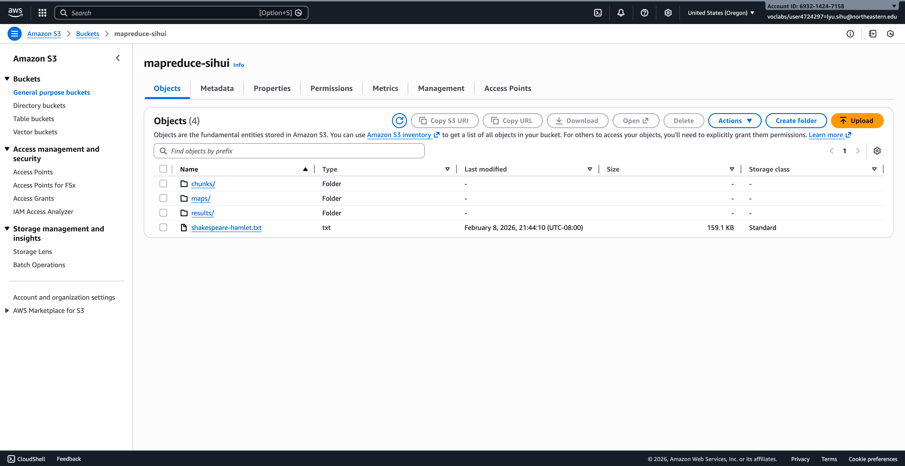

The bucket stores:

- Original input file
- Chunk files
- Mapper outputs
- Final reducer result

---

### Chunk Files Generated by Splitter

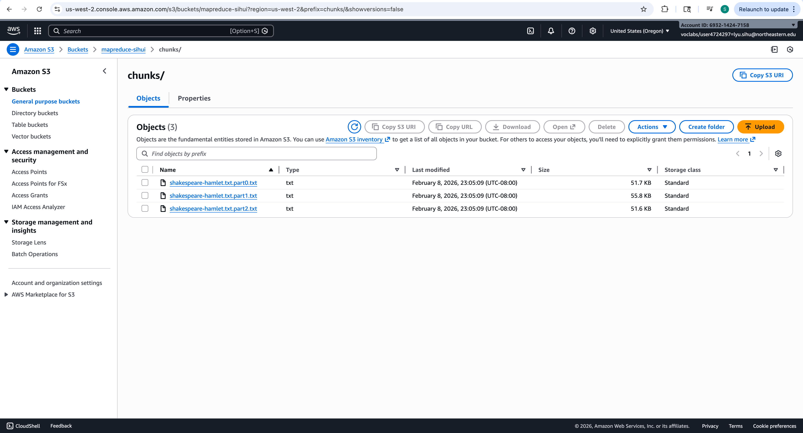

The splitter successfully divided the input file into three equal parts.

---

### Mapper Outputs (Intermediate Results)

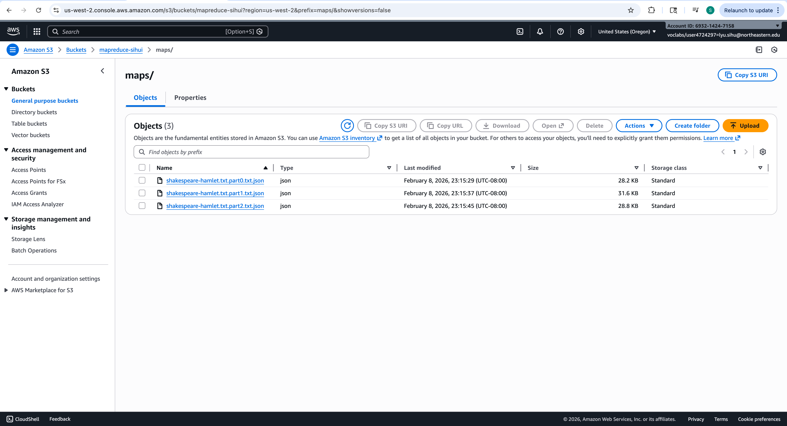

Each mapper produced a JSON file containing word frequencies.

---

### Final Reducer Output

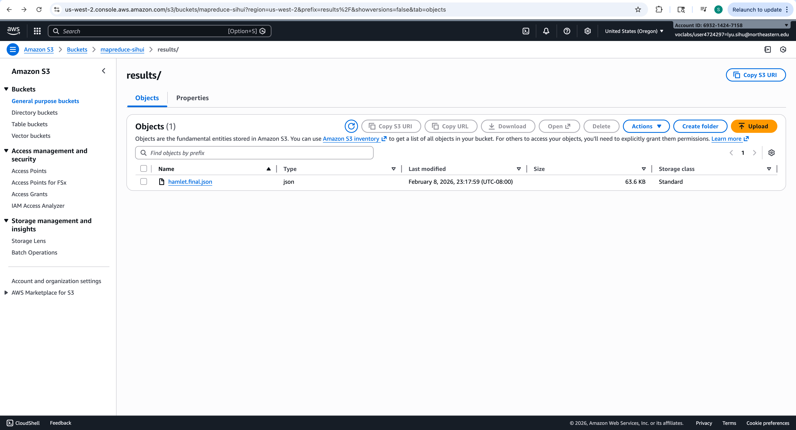

Detailed view:

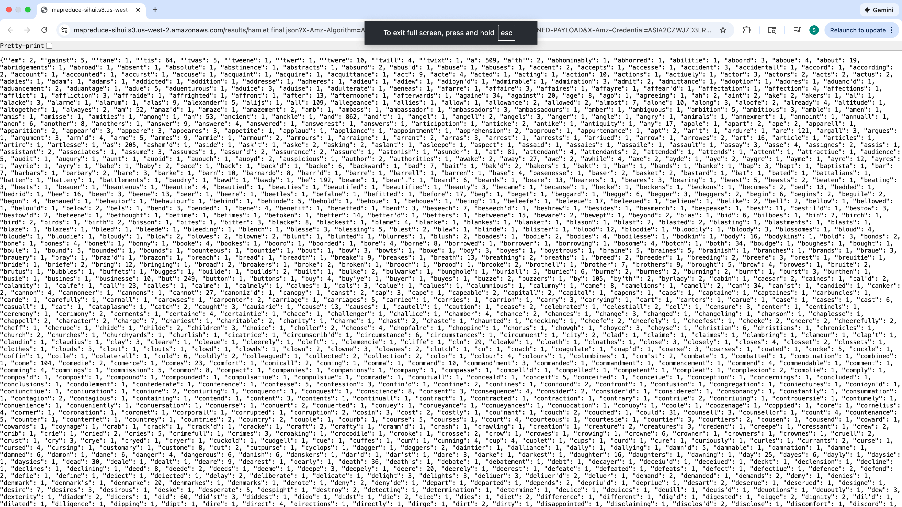

---

## Experiment

To evaluate the benefits and tradeoffs of distributed execution, two configurations were tested.

---

## Parallel Configuration

**Pipeline:**  
1 Splitter → 3 Mappers → 1 Reducer

### Results

- **Total words:** 29,693
- **Unique words:** 4,815
- **Reducer latency:** **148 ms**

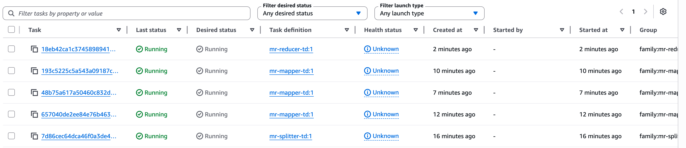

---

## Single Mapper Configuration

**Pipeline:**  
1 Splitter → 1 Mapper → 1 Reducer

### Results

- **Total words:** 29,693
- **Unique words:** 4,815
- **Reducer latency:** **98 ms**

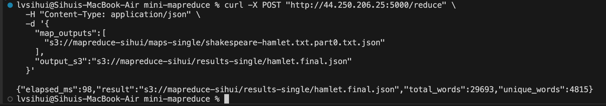

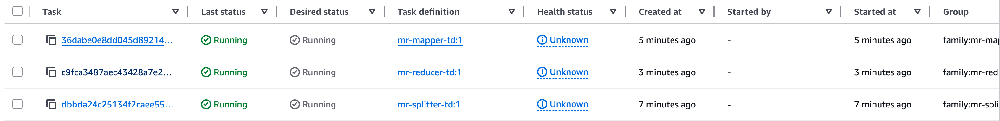

Both configurations produced identical outputs, verifying correctness.

---

## Analysis

Interestingly, the single-mapper configuration completed faster than the three-mapper setup.

This behavior is expected for smaller workloads because distributed systems introduce coordination overhead such as:

- Container startup latency
- Task scheduling delays
- Network transfers from S3
- Result aggregation

According to **Amdahl’s Law**, the speedup gained from parallelism is limited by the sequential portion of the workload. When datasets are relatively small, overhead dominates execution time, making parallel execution less efficient.

However, distributed architectures optimize for **scalability rather than raw latency**. As data size grows, the benefits of parallel processing become increasingly significant.

---

## Challenges

The most challenging aspects of this project included:

- Configuring ECS networking and public IP access
- Resolving container architecture mismatches (ARM vs AMD64)
- Managing IAM permissions for S3
- Debugging container pull and runtime errors
- Coordinating multiple distributed tasks manually

These challenges highlight the operational complexity behind distributed systems and emphasize the importance of orchestration tools.

---

## Key Takeaways

- Distributed systems improve scalability
- Parallelism is not always faster for small workloads
- Coordination overhead is a fundamental tradeoff
- Cloud infrastructure simplifies deployment but requires careful configuration

---

## Future Improvements

Potential enhancements include:

- Automatic task orchestration
- Dynamic scaling of mapper nodes
- Fault tolerance and retry mechanisms
- Streaming-based processing
- Performance benchmarking with larger datasets

---

## Conclusion

This project successfully implemented a mini MapReduce framework in the cloud and demonstrated how distributed systems process data efficiently at scale.

While parallel execution introduces overhead, it remains essential for handling large-scale workloads — reinforcing why MapReduce continues to be a foundational model in distributed computing.
