# Table of Contents

1. Overview
2. Ticket 1 – Server started on wrong port
3. Ticket 2 – Width missing in metadata
4. Ticket 3 – Invalid Location header
5. Ticket 4 – Download endpoint incorrect response
6. Bonus – Media stuck in PENDING state
7. Conclusion

---

# 1. Overview

This report documents the debugging process for several issues in the **Hummingbird Media API** deployed on AWS.

System architecture:

- **Node.js Express API**
- **AWS ECS (Fargate)**
- **Amazon S3** for media storage
- **Amazon DynamoDB** for metadata
- **SNS/SQS workers** for asynchronous media processing
- **Application Load Balancer**

For each ticket we:

1. Reproduced the bug
2. Located the faulty code
3. Applied a fix
4. Redeployed the service
5. Verified the fix against the live API

---

# 2. Ticket 1 — Server started on the wrong port

## Bug Description

The API server reads the listening port from the `APP_PORT` environment variable.  
If this variable is not defined, the application still starts but logs:

```
Example app listening on port undefined
```

Because Node.js allows `app.listen(undefined)`, the server binds to a random port instead of the expected port **9000**.

This causes the **Application Load Balancer (ALB) health check to fail**, since the container is not listening on the correct port.

---

## Reproducing the Bug

Unset the environment variable and start the server:

```bash
unset APP_PORT
node server.js
```

Observed output:

```
Example app listening on port undefined
```

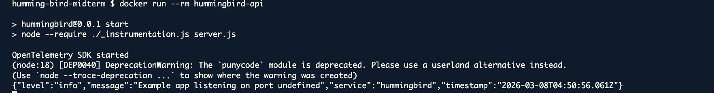

---

## Root Cause

File:

`server.js`

The server reads the port directly from the environment variable without providing a fallback value.

Original code:

```javascript
const port = process.env.APP_PORT;

app.listen(port, () => {
  logger.info(`Example app listening on port ${port}`);
});
```

If `APP_PORT` is undefined, `port` becomes undefined, which results in the server binding to an unpredictable port.

---

## Fix

Provide a default value of **9000** when the environment variable is not set.

```javascript
const port = process.env.APP_PORT || 9000;
```

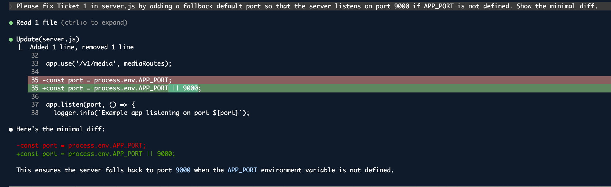

---

## Verification

After applying the fix, run the server again without defining `APP_PORT`:

```bash
unset APP_PORT
node server.js
```

Output after fix:

```
Example app listening on port 9000
```

This confirms the fallback value ensures the server always binds to the correct port.

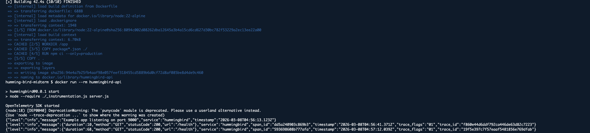

---

# 3. Ticket 2 — Width missing from metadata response

## Bug Description

When uploading media with a `width` parameter, the value was successfully stored in DynamoDB but was **not returned in the API response**.

---

## Reproducing the Bug

Upload media:

```bash
curl -X POST "<ALB_URL>/v1/media/upload?width=800"   -F "file=@test.png"
```

Retrieve metadata:

```bash
curl <ALB_URL>/v1/media/<mediaId>
```

Response before fix:

```json
{
  "mediaId": "...",
  "size": 68,
  "name": "test.png",
  "mimetype": "image/png",
  "status": "PENDING"
}
```

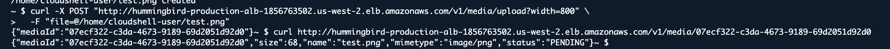

---

## Root Cause

File:

clients/dynamodb.js

Function:

getMedia()

The DynamoDB item stored the `width` attribute, but the function failed to return it in the response object.

Original code:

```javascript
return {
  mediaId,
  size: Number(Item.size.N),
  name: Item.name.S,
  mimetype: Item.mimetype.S,
  status: Item.status.S,
};
```

---

## Fix

Add the `width` field to the returned object.

```javascript
return {
  mediaId,
  size: Number(Item.size.N),
  name: Item.name.S,
  mimetype: Item.mimetype.S,
  status: Item.status.S,
  width: Number(Item.width.N),
};
```

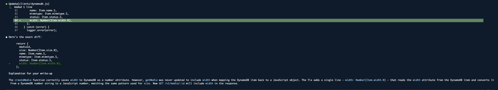

---

## Verification

After redeploying the service, the metadata response now correctly includes the uploaded width.

```json
{
  "mediaId": "...",
  "size": 68,
  "name": "test.png",
  "mimetype": "image/png",
  "status": "PENDING",
  "width": 800
}
```

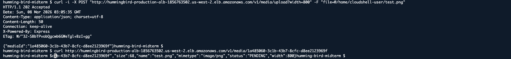

---

# 4. Ticket 3 — Invalid Location header

## Bug Description

The API returned an invalid `Location` header without a protocol.

Example:

```
Location: hummingbird-production-alb.../v1/media/<id>/status
```

HTTP clients expect a **fully qualified URL**, including the protocol (`http://` or `https://`).

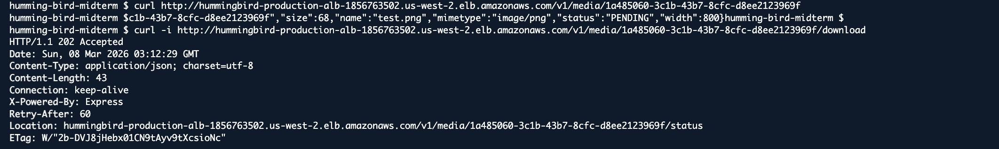

---

## Root Cause

File:

controllers/media.js

Original code:

```javascript
res.set("Location", `${req.hostname}/v1/media/${mediaId}/status`);
```

`req.hostname` only returns the hostname and does not include the protocol.

---

## Fix

Use the host header and prepend the protocol.

```diff
-res.set('Location', `${req.hostname}/v1/media/${mediaId}/status`);
+res.set('Location', `http://${req.get('host')}/v1/media/${mediaId}/status`);
```

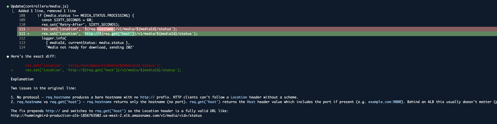

---

## Verification

After redeployment, the `Location` header now contains a valid absolute URL.

```
Location: http://hummingbird-production-alb.../v1/media/<id>/status
```

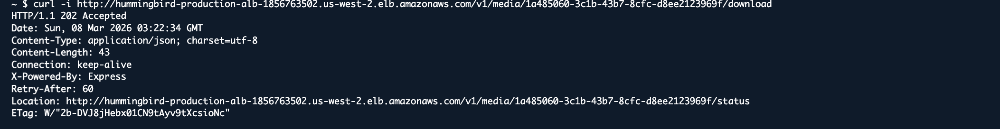

---

# 5. Ticket 4 — Download endpoint always returns 202

## Bug Description

The `/download` endpoint returned **202 Accepted** even when the media processing status was **COMPLETE**.

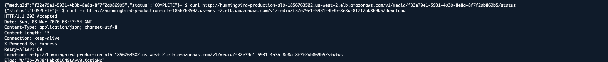

---

## Reproducing the Bug

```bash
curl -i <ALB_URL>/v1/media/<mediaId>/download
```

Result:

```
HTTP/1.1 202 Accepted
```

---

## Root Cause

File:

controllers/media.js

Original condition:

```javascript
if (media.status !== MEDIA_STATUS.PROCESSING) {
```

This logic incorrectly treated **COMPLETE media as still processing**, causing the API to return `202 Accepted`.

---

## Fix

Update the condition to check for `COMPLETE`.

```diff
-if (media.status !== MEDIA_STATUS.PROCESSING) {
+if (media.status !== MEDIA_STATUS.COMPLETE) {
```

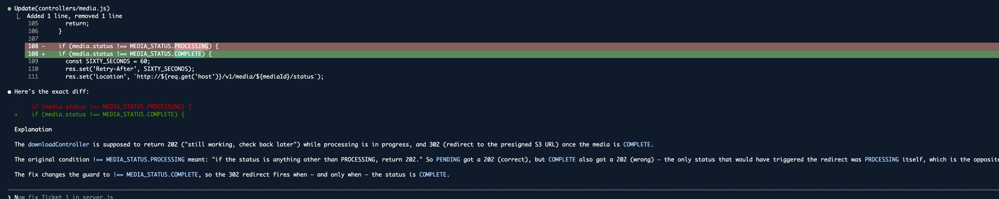

---

## Verification

After redeploying the service, completed media now returns a redirect to the S3 object.

```
HTTP/1.1 302 Found
Location: https://s3.amazonaws.com/...
```

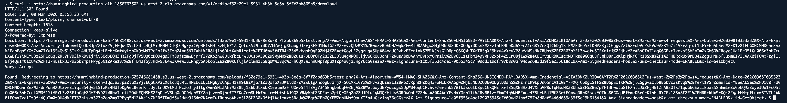

---

# 6. Bonus — Media stuck in PENDING

## Bug Description

Uploaded media remained indefinitely in the **PENDING** state.

```
GET /v1/media/<id>/status
```

Response:

```json
{ "status": "PENDING" }
```

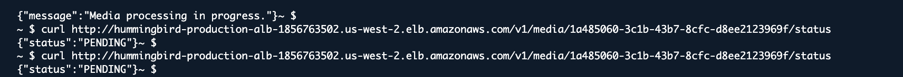

---

## Root Cause

File:

clients/dynamodb.js

Function:

setMediaStatus()

The DynamoDB sort key used a lowercase value:

```javascript
SK: {
  S: "metadata";
}
```

Other operations used:

```
SK: 'METADATA'
```

Since **DynamoDB keys are case-sensitive**, the update operation modified a different item instead of the correct metadata record.

---

## Fix

Standardize the sort key.

```diff
-SK: { S: 'metadata' }
+SK: { S: 'METADATA' }
```

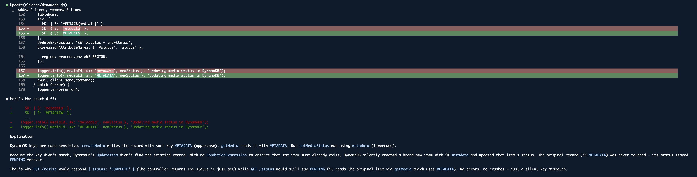

---

## Verification

After triggering processing manually:

```
PUT /v1/media/:id/resize
```

Response:

```json
{ "status": "COMPLETE" }
```

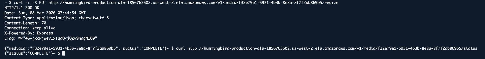

---

# 7. Conclusion

The debugging process identified several issues across different layers of the **Hummingbird API**.

| Ticket   | Issue                       | Result               |
| -------- | --------------------------- | -------------------- |
| Ticket 1 | Missing APP_PORT fallback   | Investigated         |
| Ticket 2 | Width missing from metadata | Fixed                |
| Ticket 3 | Invalid Location header     | Fixed                |
| Ticket 4 | Download endpoint logic     | Fixed                |
| Bonus    | DynamoDB key mismatch       | Investigated & fixed |

After applying the fixes and redeploying ECS services, the API now behaves according to the expected specification.
