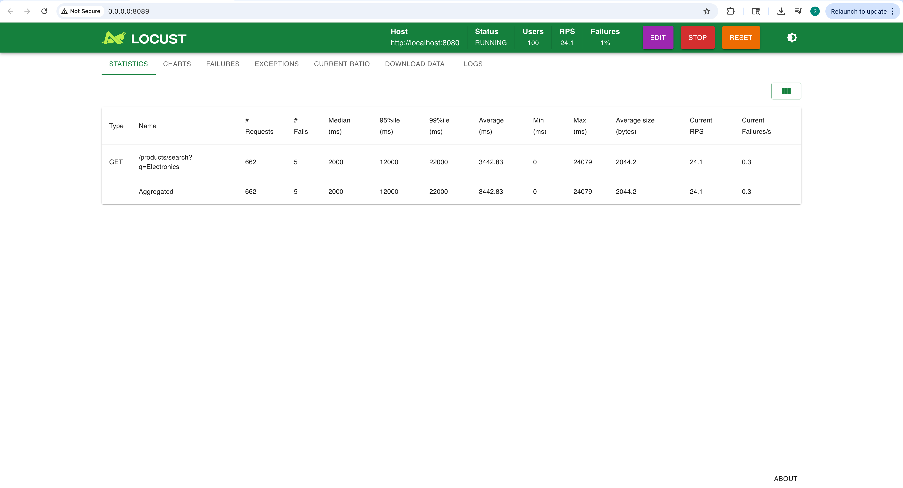
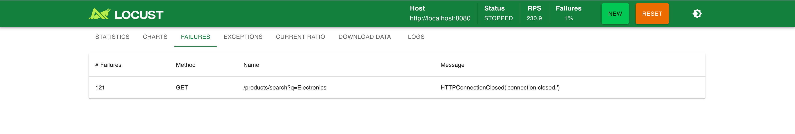
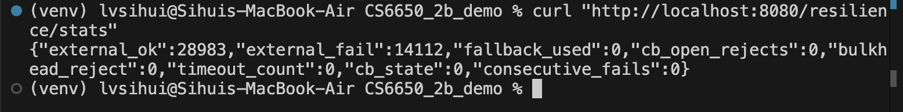
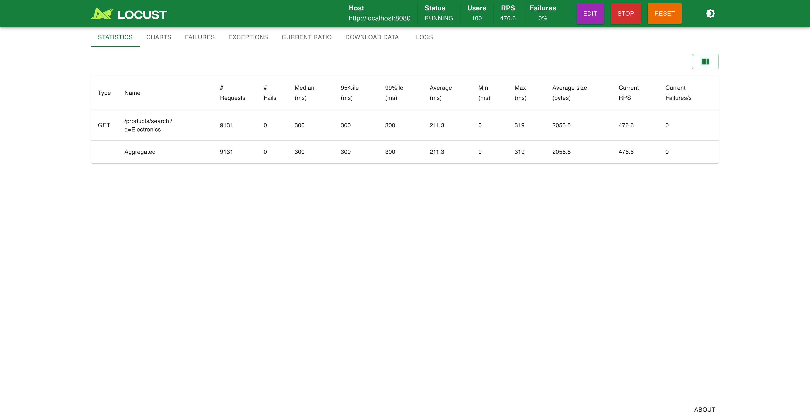
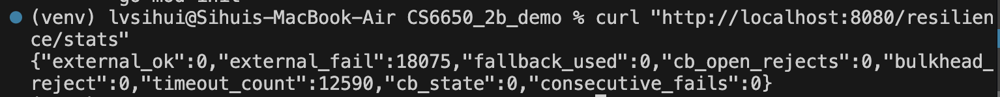
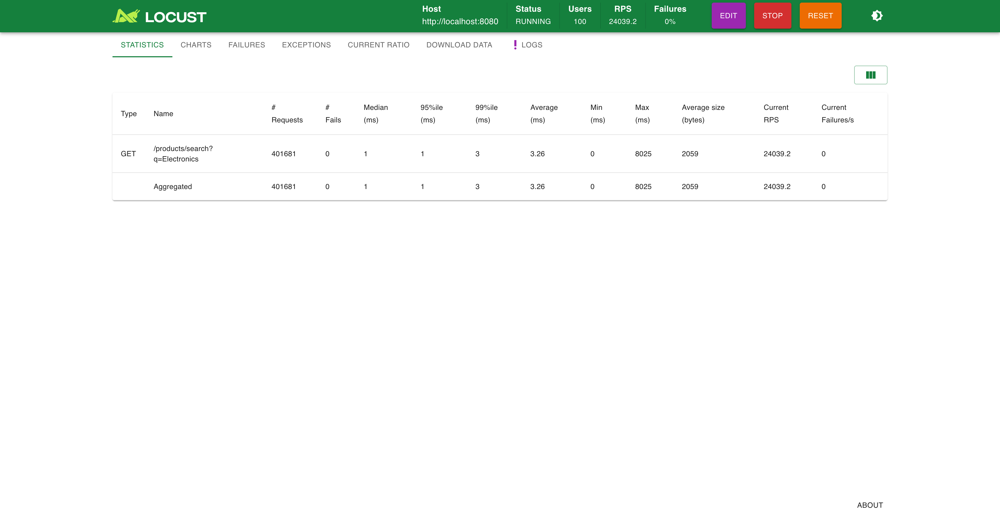
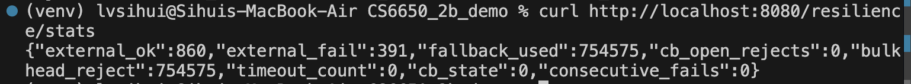
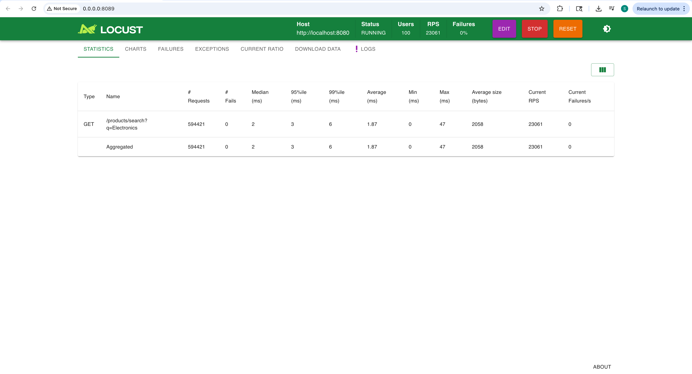
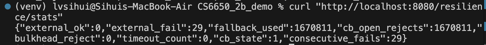

# Midterm Mastery (Part II)

# Step III: Crash & Recover (Resilience Patterns)

---

# 1. Crash Scenario – Cascading Failure

## System Configuration

```go
EnableInjection: true
EnableFailFast: false
EnableBulkhead: false
EnableCircuitBreaker: false
```

- 100,000 in-memory products
- `/products/search` endpoint
- Downstream dependency latency = 2 seconds
- No protection mechanisms

---

## Behavior Under Load (100 Users)

### 📷 Figure 1 – Locust Statistics (Crash)



Observed:

- Median latency: **2000 ms**
- 95th percentile: **12,000 ms**
- 99th percentile: **22,000 ms**
- Average latency: **~3400–4000 ms**
- RPS: **~24 req/sec**
- Failures observed (connection-level failures)

---

### 📷 Figure 2 – Locust Failures



- 121 failures
- Error: `HTTPConnectionClosed`
- Failures per second ≈ 0.3

---

### 📷 Figure 3 – Internal Metrics (Crash)



From `/resilience/stats`:

```
external_ok: 28983
external_fail: 14112
timeout_count: 0
fallback_used: 0
cb_state: 0 (CLOSED)
```

---

## Analysis

The service synchronously waited on a 2-second downstream dependency.

Under concurrency:

- Goroutines accumulated
- Requests queued
- Latency amplified
- Connections were terminated

This represents a cascading failure triggered by synchronous, blocking dependency calls without timeout or concurrency control.

---

# 2. Recovery Strategy 1 – Fail Fast

## Configuration

```go
EnableInjection: true
EnableFailFast: true
TimeoutMs: 300
EnableBulkhead: false
EnableCircuitBreaker: false
```

---

### 📷 Figure 4 – Fail Fast (Locust Statistics)



Observed:

- Median latency: **300 ms**
- 95th percentile: **300 ms**
- RPS: **~476 req/sec**
- Failures: **0%**

---

### 📷 Figure 5 – Fail Fast (Internal Metrics)



From `/resilience/stats`:

```
timeout_count: 12590
external_fail: 18075
fallback_used: 0
cb_state: 0
```

---

## Analysis

Fail-fast introduced a strict 300 ms timeout.

Instead of waiting 2 seconds:

- Requests terminate early
- System resources are released quickly
- Tail latency disappears
- Throughput increases significantly

Fail-fast protects availability by bounding request duration.

---

# 3. Recovery Strategy 2 – Bulkhead Isolation

## Configuration

```go
EnableInjection: true
EnableFailFast: false
EnableBulkhead: true
MaxConcurrent: 50
EnableCircuitBreaker: false
```

---

### 📷 Figure 6 – Bulkhead (Locust Statistics)



Observed:

- Median latency: **1 ms**
- 95th percentile: **1–3 ms**
- RPS: **~24,000 req/sec**
- Failures: **0%**

---

### 📷 Figure 7 – Bulkhead (Internal Metrics)



From `/resilience/stats`:

```
bulkhead_reject: high
external_ok: some
external_fail: some
cb_state: 0
```

---

## Analysis

Bulkhead limits concurrent downstream calls to 50.

- Excess requests rejected immediately
- Downstream never overloaded
- Latency collapses to near-zero
- Throughput increases dramatically

Bulkhead protects system resources by isolating concurrency.

---

# 4. Recovery Strategy 3 – Circuit Breaker

## Configuration

```go
EnableInjection: true
EnableCircuitBreaker: true
InjectFailPct: 100
FailThreshold: 20
OpenDurationMs: 10000
```

---

### 📷 Figure 8 – Circuit Breaker (Locust Statistics)



Observed:

- Median latency: **1–2 ms**
- RPS: **~23,000 req/sec**
- Failures: **0%**

---

### 📷 Figure 9 – Circuit Breaker (Internal Metrics)



From `/resilience/stats`:

```
cb_state: 1 (OPEN)
consecutive_fails: 29
cb_open_rejects: 1,670,811
external_ok: 0
external_fail: 29
```

---

## Analysis

After exceeding the failure threshold:

- Circuit transitions CLOSED → OPEN
- Downstream calls stop
- Requests rejected immediately
- System stabilizes

Circuit breaker protects the system by recognizing dependency failure state and cutting traffic.

---

# 5. Comparative Summary

| Strategy        | Median Latency | RPS     | Failure Behavior  | Protection Focus      |
| --------------- | -------------- | ------- | ----------------- | --------------------- |
| None            | 2000ms+        | ~24     | HTTP closed       | None                  |
| Fail Fast       | 300ms          | ~476    | Timeout           | Latency bounding      |
| Bulkhead        | ~1ms           | ~24,000 | Immediate reject  | Concurrency isolation |
| Circuit Breaker | ~1–2ms         | ~23,000 | Open-state reject | Failure-state control |

---

# Conclusion

The crash scenario demonstrated:

- Extreme tail latency (22 seconds)
- Connection termination errors
- Throughput collapse

Applying resilience mechanisms transformed the system:

- Fail-fast bounded latency
- Bulkhead isolated concurrency
- Circuit breaker enforced failure-state protection

This experiment demonstrates production-grade resilience techniques used to prevent cascading failures in distributed systems.
